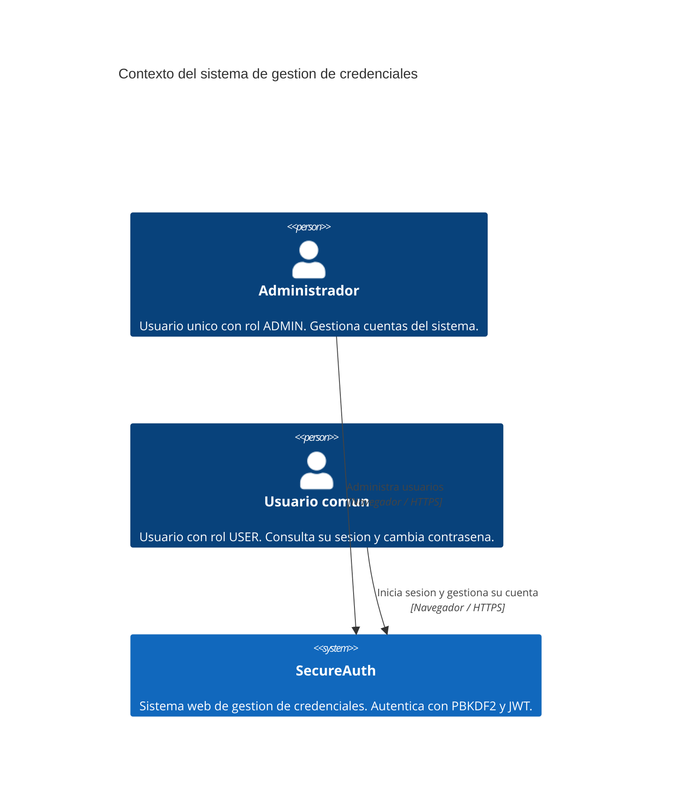
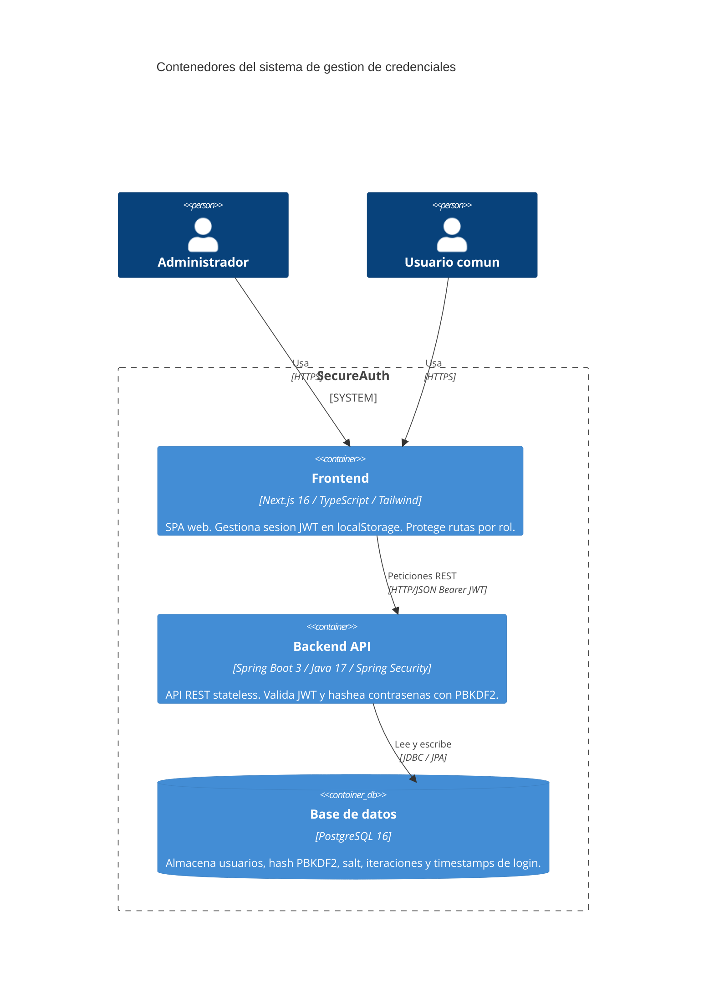
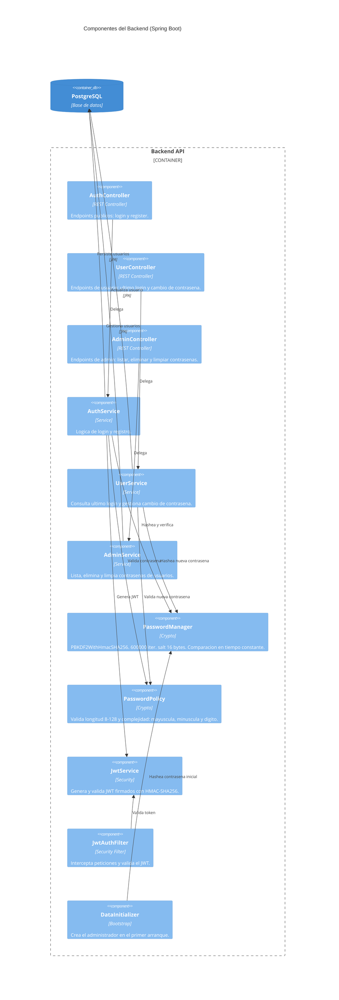
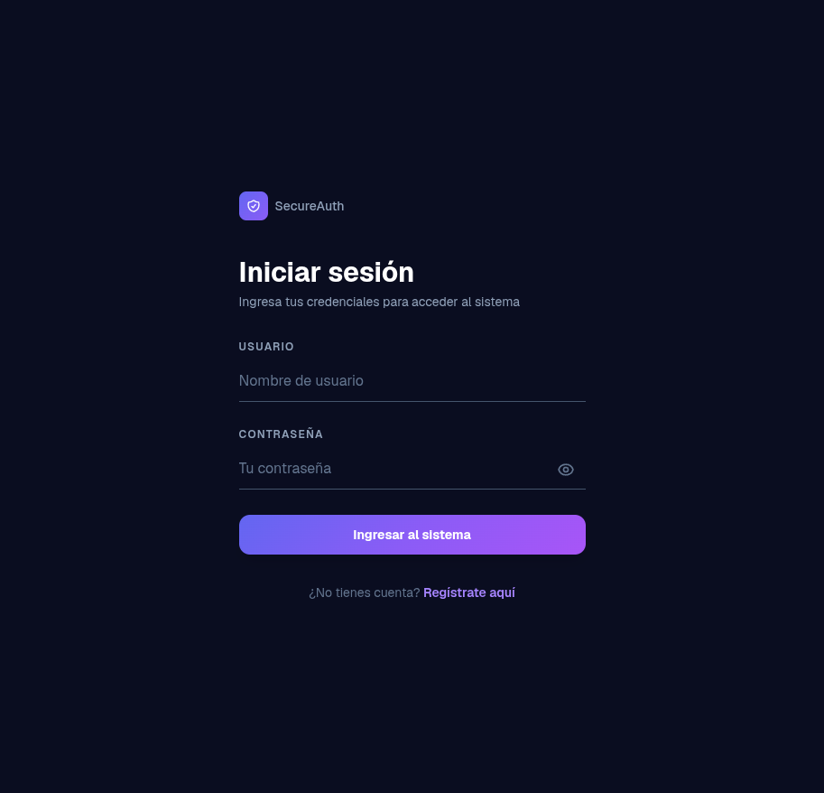
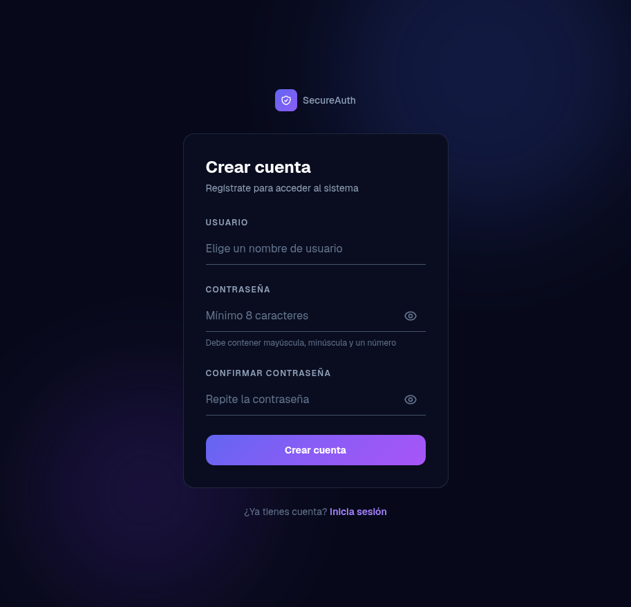
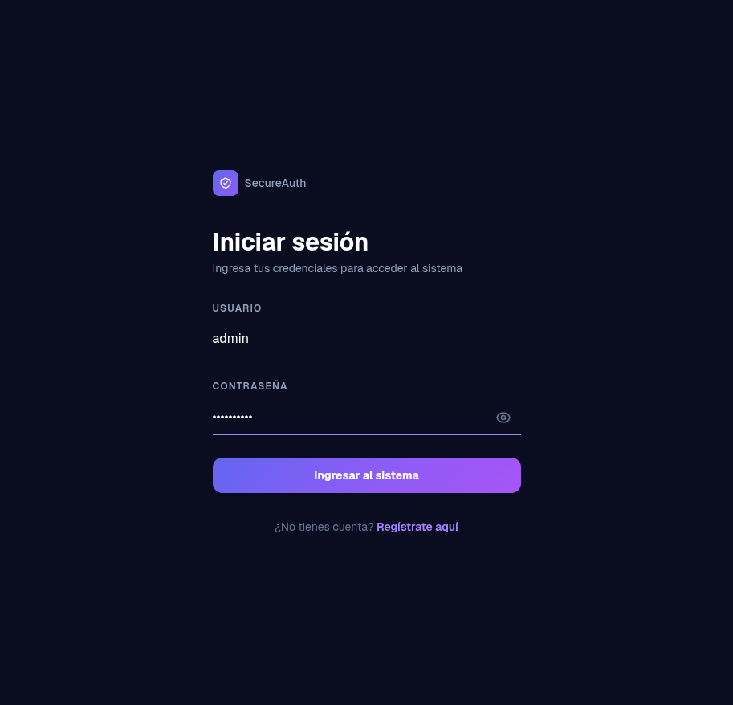
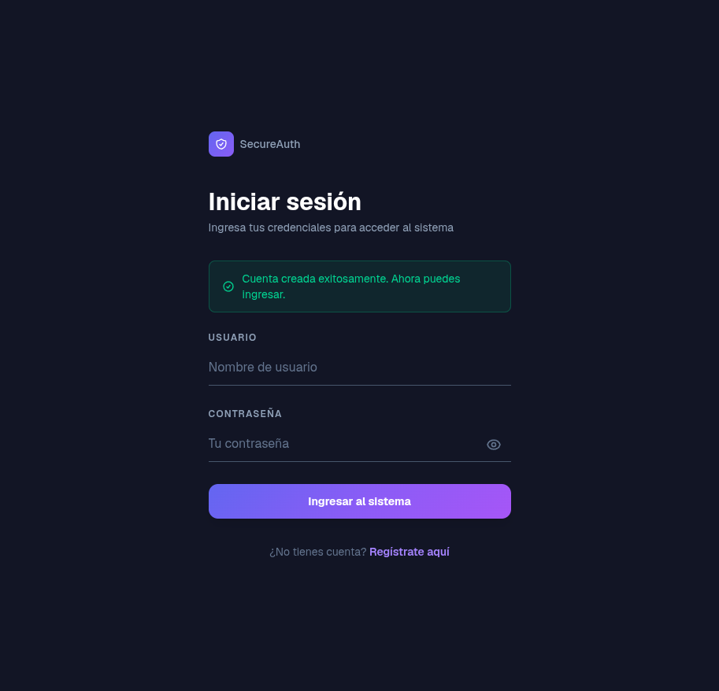
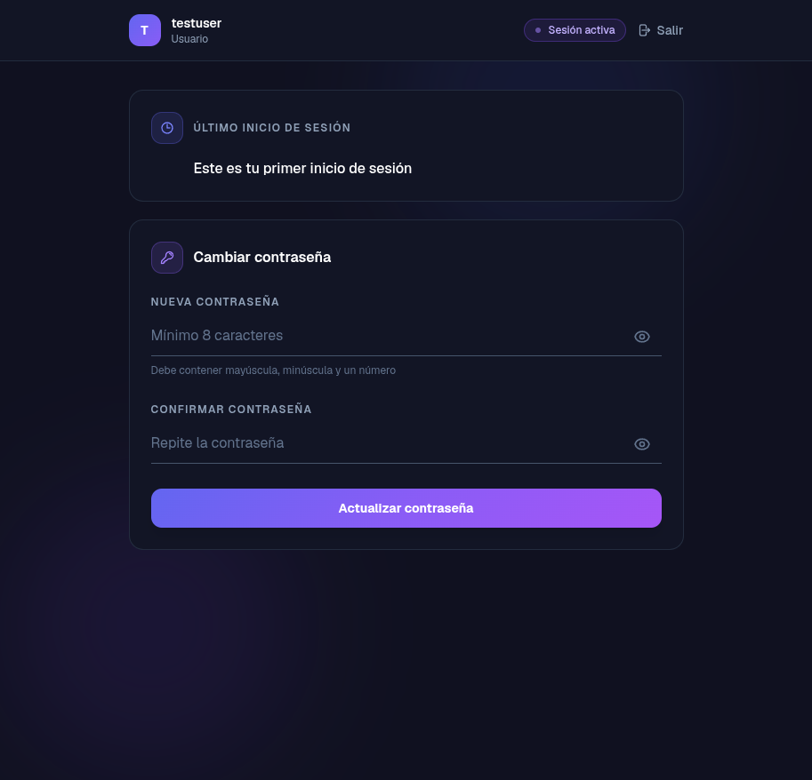
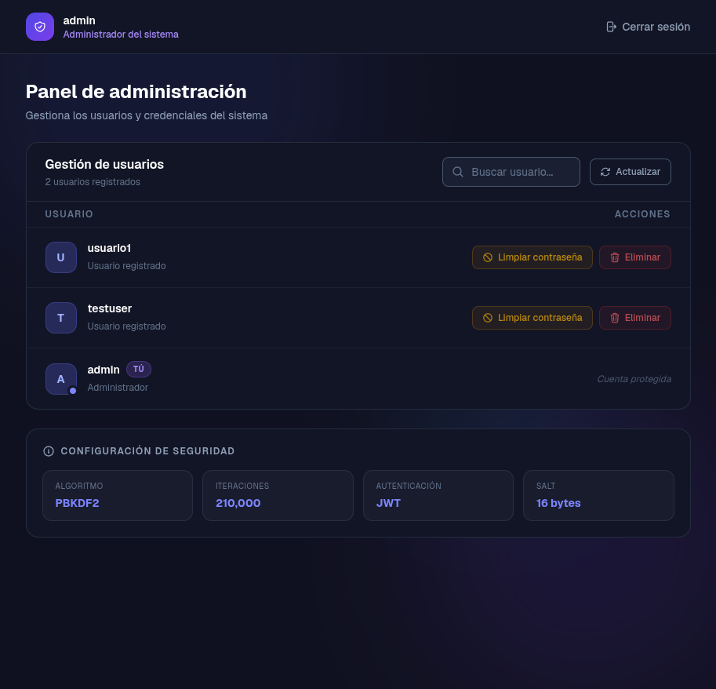
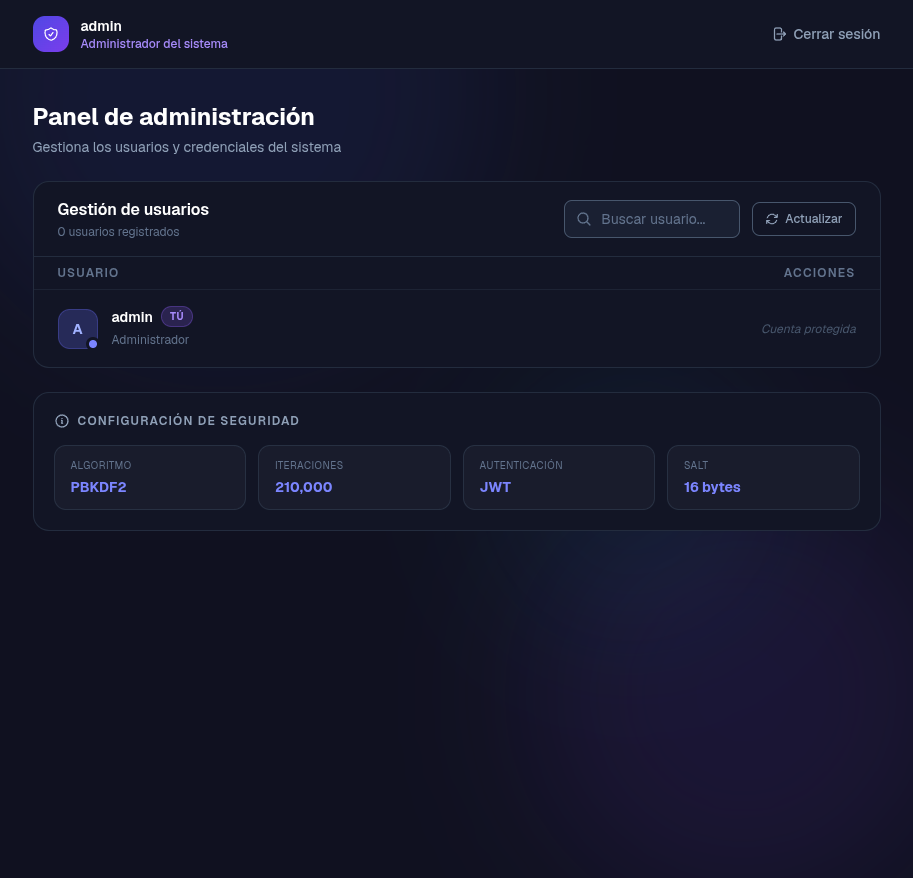

# Informe — Sistema de gestión de credenciales con PBKDF2

## Tabla de contenido

1. [Descripción del proyecto](#descripción-del-proyecto)
2. [Arquitectura y tecnologías](#arquitectura-y-tecnologías)
3. [Manera cómo se hizo el programa](#manera-cómo-se-hizo-el-programa)
   - [Backend (Spring Boot)](#backend-spring-boot)
   - [Frontend (Next.js)](#frontend-nextjs)
   - [Despliegue con Docker](#despliegue-con-docker)
4. [Pantallazos de la aplicación](#pantallazos-de-la-aplicación)
5. [Dificultades encontradas](#dificultades-encontradas)
6. [Conclusiones](#conclusiones)

---

## Descripción del proyecto

Se implementó un sistema de autenticación seguro que permite gestionar usuarios y contraseñas de una plataforma. El sistema cuenta con dos roles:

- **Administrador** (único): puede listar todos los usuarios registrados, eliminar una cuenta y dejar en blanco la contraseña de un usuario.
- **Usuario común**: puede consultar su última fecha/hora de inicio de sesión y cambiar su contraseña.

Las contraseñas se almacenan en una base de datos PostgreSQL usando el algoritmo **PBKDF2WithHmacSHA256** con salt aleatorio criptográficamente seguro, siguiendo las recomendaciones de OWASP 2023.

---

## Arquitectura y tecnologías

| Capa | Tecnología |
|------|-----------|
| Frontend | Next.js 16 (App Router), TypeScript, Tailwind CSS |
| Backend | Spring Boot 3, Spring Security, Spring Data JPA |
| Base de datos | PostgreSQL 16 |
| Autenticación | JSON Web Tokens (JWT / HMAC-SHA256) |
| Cifrado de contraseñas | PBKDF2WithHmacSHA256, 600 000 iteraciones, salt de 16 bytes |
| Contenedores | Docker / Docker Compose |

### Diagrama C4 — Nivel 1: Contexto del sistema



### Diagrama C4 — Nivel 2: Contenedores



### Diagrama C4 — Nivel 3: Componentes del Backend



---

## Manera cómo se hizo el programa

### Backend (Spring Boot)

#### 1. Modelo de datos

Se definió la entidad `User` con los campos:

- `username` — clave primaria (string único)
- `passwordHash` — hash derivado con PBKDF2 (Base64)
- `salt` — salt aleatorio de 16 bytes (Base64)
- `iterations` — factor de trabajo usado al hashear (permite migración futura)
- `role` — enum `ADMIN` | `USER`
- `lastLogin` / `currentLogin` — marcas de tiempo para mostrar la sesión anterior

#### 2. Cifrado de contraseñas (`PasswordManager`)

Se implementó PBKDF2 directamente con la JCA (Java Cryptography Architecture) sin bibliotecas externas:

```java
// Parámetros elegidos según OWASP 2023
private static final String ALGORITHM  = "PBKDF2WithHmacSHA256";
private static final int    SALT_LENGTH = 16;    // bytes
private static final int    KEY_LENGTH  = 256;   // bits
public  static final int    ITERATIONS  = 600_000;
```

Consideraciones de seguridad aplicadas:

- Las contraseñas se manejan como `char[]` (nunca `String`) para poder borrarlas de memoria después de usarlas.
- La comparación usa `MessageDigest.isEqual()` (tiempo constante) para evitar ataques de temporización.
- El salt se genera con `SecureRandom`, que garantiza aleatoriedad criptográfica.
- La longitud máxima de contraseña se limita a 128 caracteres para prevenir ataques de DoS a través de PBKDF2.

#### 3. Política de contraseñas (`PasswordPolicy`)

Se validó en el servidor (no solo en el cliente) que cada contraseña:

- Tenga entre 8 y 128 caracteres.
- Contenga al menos una mayúscula, una minúscula y un dígito.

#### 4. Autenticación con JWT (`JwtService`)

Al hacer login exitoso se genera un JWT firmado con HMAC-SHA256 que incluye el `username` y el `role`. Ese token se envía al frontend, que lo adjunta en el encabezado `Authorization: Bearer <token>` en cada petición protegida.

#### 5. Seguridad de endpoints (`SecurityConfig`)

Spring Security protege cada ruta por rol:

- `POST /api/auth/login` y `POST /api/auth/register` — públicos.
- `GET/PUT /api/user/**` — requieren rol `USER`.
- `GET/DELETE/PUT /api/admin/**` — requieren rol `ADMIN`.

#### 6. Inicialización del administrador (`DataInitializer`)

Al arrancar la aplicación por primera vez, se verifica si ya existe un usuario `admin`. Si no existe, se crea con la contraseña indicada en la variable de entorno `APP_ADMIN_PASSWORD`, hasheada con PBKDF2.

---

### Frontend (Next.js)

#### Estructura de rutas (App Router)

```
app/
├── page.tsx          → Redirige según el rol (ADMIN→/admin, USER→/dashboard, sin sesión→/login)
├── login/page.tsx    → Formulario de autenticación con panel visual decorativo
├── register/page.tsx → Registro de nuevos usuarios (rol USER únicamente)
├── dashboard/page.tsx→ Panel del usuario: último login + cambio de contraseña
└── admin/page.tsx    → Panel del administrador: listar, eliminar, limpiar contraseñas
```

#### Cliente HTTP (`lib/api.ts`)

Se centralizaron todas las llamadas REST en un módulo con tres namespaces:

- `authApi` — endpoints públicos (`login`, `register`).
- `userApi` — endpoints del usuario común (`lastLogin`, `changePassword`).
- `adminApi` — endpoints exclusivos del administrador (`listUsers`, `deleteUser`, `clearPassword`).

El módulo extrae el mensaje de error del JSON del backend para mostrarlo al usuario sin exponer trazas de pila.

#### Sesión (`lib/auth.ts`)

El JWT y los datos del usuario se almacenan en `localStorage`. La función `getUser()` devuelve el objeto de usuario o `null` si no hay sesión activa; cada página la consulta en `useEffect` para redirigir si es necesario.

#### Diseño visual

Se utilizó un diseño oscuro (fondo `#07091a`) con gradientes violeta/índigo para los botones y detalles de color. La página de login tiene un panel dividido: formulario a la izquierda y un escudo SVG animado con _blobs_ de color a la derecha (solo visible en pantallas grandes). Las demás páginas usan _blobs_ decorativos de fondo con `position: fixed`.

---

### Despliegue con Docker

Se configuraron tres servicios en `docker-compose.yml`:

1. **db** — PostgreSQL 16 con _healthcheck_.
2. **backend** — Spring Boot; espera a que la base de datos esté sana antes de arrancar.
3. **frontend** — Next.js en modo producción (`node server.js`); se construye en una imagen multistage.

Todas las credenciales y secretos se inyectan como variables de entorno desde un archivo `.env` que no se versiona en Git.

---

## Pantallazos de la aplicación

### Página de inicio de sesión

<!-- PANTALLAZO: Pegar aquí la captura de la pantalla de login (vista completa) -->


---

### Página de registro

<!-- PANTALLAZO: Pegar aquí la captura de la pantalla de registro -->


---

### Login con credenciales ingresadas

<!-- PANTALLAZO: Pegar aquí la captura del formulario con credenciales escritas -->


---

### Registro exitoso — banner de confirmación

<!-- PANTALLAZO: Pegar aquí la captura del banner verde de "Cuenta creada exitosamente" -->


---

### Dashboard del usuario común

<!-- PANTALLAZO: Pegar aquí la captura del panel de usuario con último login y cambio de contraseña -->


---

### Panel de administración (con usuarios registrados)

<!-- PANTALLAZO: Pegar aquí la captura del panel admin con la lista de usuarios -->


---

### Panel de administración — configuración de seguridad

<!-- PANTALLAZO: Pegar aquí la captura de las tarjetas de seguridad (PBKDF2, iteraciones, JWT, Salt) -->


---

## Dificultades encontradas

### 1. Manejo de zonas horarias en `lastLogin`

El backend almacena los timestamps en UTC en PostgreSQL, pero al enviarlos al frontend sin conversión explícita, las fechas aparecían desplazadas varias horas respecto a la zona horaria local del usuario. Se resolvió convirtiendo el timestamp en el frontend con `toLocaleString('es-CO', ...)` y ajustando el tipo devuelto por el backend para incluir la información de zona (`OffsetDateTime`).

### 2. Variables de entorno en Next.js con Docker

Next.js distingue entre variables de entorno del servidor (solo accesibles en SSR) y del cliente (deben tener el prefijo `NEXT_PUBLIC_`). En el contexto de Docker Compose la URL del backend se construye en tiempo de _build_, lo que requirió pasar `NEXT_PUBLIC_API_URL` como argumento de build _y_ como variable de entorno de ejecución. Configurar correctamente este flujo tomó varias iteraciones.

### 3. `useSearchParams` requiere un límite de Suspense

Next.js 13+ con el App Router lanza un error en tiempo de compilación si un componente llama a `useSearchParams()` sin estar envuelto en un `<Suspense>`. La página de login usa este hook para detectar el parámetro `?registered=1` y mostrar el banner de éxito. La solución fue envolver el componente interno en un `<Suspense>` con un fragmento vacío como fallback.

### 4. Longitud máxima de contraseña y DoS en PBKDF2

Durante la investigación se encontró que PBKDF2 no impone límite de longitud a la entrada. Sin un tope, un atacante podría enviar contraseñas de varios megabytes y forzar un proceso de hashing extremadamente costoso en el servidor. Se añadió la restricción de 128 caracteres máximo en `PasswordPolicy`, lo que acota el trabajo de PBKDF2 a una entrada predecible.

### 5. Comparación de hashes en tiempo constante

La comparación naïve con `String.equals()` es vulnerable a ataques de temporización: dependiendo de en qué carácter difieren dos hashes, el tiempo de comparación varía, filtrando información. Se reemplazó por `MessageDigest.isEqual()`, que siempre recorre todos los bytes independientemente del punto de divergencia.

### 6. Gestión segura de contraseñas en memoria (Java)

En Java los objetos `String` son inmutables y se internan; una contraseña almacenada como `String` permanece en el heap hasta que el GC la recolecte, sin posibilidad de borrarla activamente. Se adoptó el tipo `char[]` en toda la cadena de llamadas (`PasswordPolicy.validate`, `PasswordManager.hash` y `hashPassword`), lo que permite llamar a `Arrays.fill(pw, '\0')` una vez que el hash está derivado.

### 7. CORS entre contenedores Docker

Al ejecutar el frontend y el backend en contenedores separados, el navegador bloquea las peticiones cross-origin si CORS no está configurado explícitamente en el servidor. Se configuró `SecurityConfig` para leer los orígenes permitidos desde la variable de entorno `APP_CORS_ALLOWED_ORIGINS`, evitando hardcodear la URL del frontend en el código.

---

## Conclusiones

- **PBKDF2 es una opción sólida y estándar** para el almacenamiento de contraseñas. Su factor de trabajo ajustable (número de iteraciones) permite adaptarlo al hardware disponible; 600 000 iteraciones con HMAC-SHA256 sigue siendo la recomendación de OWASP en 2024 y hace que los ataques de fuerza bruta sean computacionalmente costosos.

- **El salt aleatorio por usuario es indispensable**: garantiza que dos usuarios con la misma contraseña produzcan hashes completamente distintos, inutilizando las tablas rainbow y los ataques de diccionario precalculados.

- **La seguridad no se logra solo con un buen algoritmo**: fue necesario combinar múltiples medidas — comparación en tiempo constante, manejo de contraseñas como `char[]`, límite de longitud, política de complejidad — para obtener una implementación robusta.

- **La autenticación basada en JWT simplifica el backend stateless**: el servidor no necesita mantener sesiones en memoria ni en base de datos; basta con validar la firma del token en cada petición.

- **Docker Compose facilitó la reproducibilidad del entorno**: cualquier integrante del equipo puede levantar la pila completa (base de datos, backend y frontend) con un solo comando, eliminando las diferencias entre entornos de desarrollo.

- **Next.js App Router impone buenas prácticas** (límites de Suspense, separación de componentes cliente/servidor, variables de entorno seguras), pero su curva de aprendizaje inicial generó fricciones que se resolvieron con documentación y depuración iterativa.
